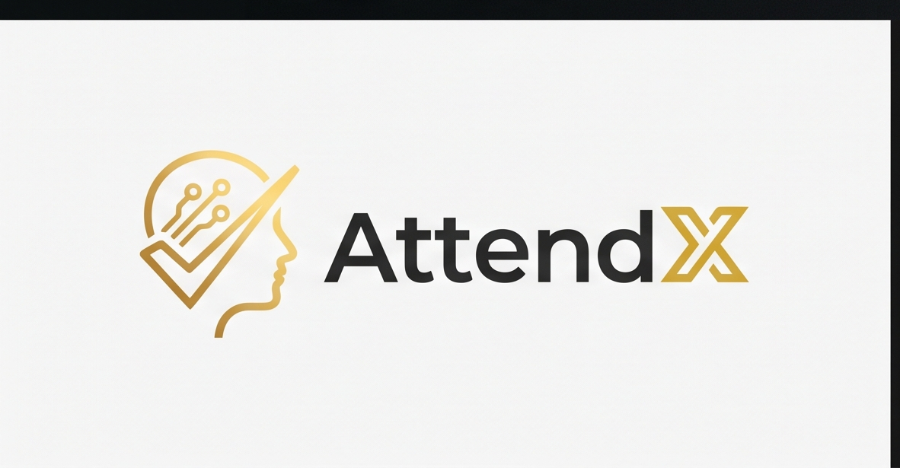

<p align="center">
  
</p>

<h1 align="center">AttendX — AI-Powered Smart Attendance System</h1>

<p align="center">
  <em>Revolutionizing attendance tracking with Face Recognition, Voice Recognition, and intelligent analytics.</em>
</p>

<p align="center">
  
  
  
  
  
  
</p>

<p align="center">
  <a href="https://attendx-046.streamlit.app">🌐 Live Demo</a> •
  <a href="#features">✨ Features</a> •
  <a href="#installation">📦 Installation</a> •
  <a href="#architecture">🏗️ Architecture</a>
</p>

---

## 📋 Table of Contents

- [Introduction](#introduction)
- [Features](#features)
- [Architecture](#architecture)
- [Tech Stack](#tech-stack)
- [Folder Structure](#folder-structure)
- [Installation Guide](#installation-guide)
- [Environment Variables](#environment-variables)
- [Database Setup](#database-setup)
- [Voice Recognition Workflow](#voice-recognition-workflow)
- [Face Recognition Workflow](#face-recognition-workflow)
- [Screenshots](#screenshots)
- [API Documentation](#api-documentation)
- [Deployment](#deployment)
- [Future Improvements](#future-improvements)
- [Team Members](#team-members)
- [License](#license)

---

## Introduction

**AttendX** is a full-stack AI-powered attendance management system designed for educational institutions. It eliminates manual roll-calls and proxy attendance through cutting-edge biometric verification using **Face Recognition** (dlib) and **Voice Recognition** (Resemblyzer).

Built with a modern dark-themed UI, AttendX provides separate dashboards for teachers and students with real-time analytics, subject management, QR-based enrollment, and comprehensive attendance tracking.

---

## Features

| Feature | Description |
|---------|-------------|
| 👤 **Face Recognition** | Real-time face detection and SVM-based classification using dlib |
| 🎙️ **Voice Recognition** | Voice print matching using Resemblyzer for roll-call scenarios |
| 📸 **Multi-Image Attendance** | Batch process multiple class photos for accurate attendance |
| 📊 **Real-Time Analytics** | Dashboard stats, attendance percentages, session history |
| 🔗 **QR Code Enrollment** | Share join codes and QR links for instant class enrollment |
| 🔄 **Biometric Updates** | Students can update face/voice data without losing history |
| 📧 **Email Verification** | Token-based email verification via EmailJS |
| 🔐 **Secure Auth** | bcrypt password hashing, rate-limited login, session cookies |
| 📱 **Responsive Design** | Optimized for desktop, tablet, and mobile viewports |
| 🌙 **Premium Dark UI** | Gold-accent dark theme with smooth animations |

---

## Architecture

```
┌──────────────────────────────────────────────────┐
│                   FRONTEND                        │
│              Streamlit (Python)                    │
│                                                    │
│  ┌──────────┐  ┌──────────┐  ┌──────────────┐    │
│  │   Home   │  │  Login/  │  │  Dashboard   │    │
│  │  Screen  │  │ Register │  │ (Teacher/    │    │
│  │          │  │          │  │  Student)    │    │
│  └──────────┘  └──────────┘  └──────────────┘    │
├──────────────────────────────────────────────────┤
│                 BUSINESS LOGIC                    │
│                                                    │
│  ┌──────────────┐  ┌───────────────────────┐     │
│  │  Auth Layer  │  │   Biometric Pipelines │     │
│  │  (auth.py)   │  │                       │     │
│  │  - Validate  │  │  ┌─────────────────┐  │     │
│  │  - Rate Limit│  │  │ Face Pipeline   │  │     │
│  │  - Verify    │  │  │ (dlib + SVM)    │  │     │
│  └──────────────┘  │  └─────────────────┘  │     │
│                     │  ┌─────────────────┐  │     │
│                     │  │ Voice Pipeline  │  │     │
│                     │  │ (Resemblyzer)   │  │     │
│                     │  └─────────────────┘  │     │
│                     └───────────────────────┘     │
├──────────────────────────────────────────────────┤
│                   DATA LAYER                      │
│                                                    │
│  ┌────────────────────────────────────────────┐  │
│  │            Supabase (PostgreSQL)            │  │
│  │                                              │  │
│  │  users · students · teachers · subjects     │  │
│  │  subject_students · attendance_logs         │  │
│  └────────────────────────────────────────────┘  │
└──────────────────────────────────────────────────┘
```

---

## Tech Stack

| Layer | Technology |
|-------|------------|
| **Frontend** | Streamlit, HTML/CSS (custom dark theme) |
| **Backend** | Python 3.10 |
| **Database** | Supabase (PostgreSQL) |
| **Face Recognition** | dlib, face_recognition_models, scikit-learn (SVM) |
| **Voice Recognition** | Resemblyzer, librosa |
| **Authentication** | bcrypt, session cookies |
| **Email** | EmailJS (REST API) |
| **QR Codes** | segno |
| **Deployment** | Streamlit Community Cloud |

---

## Folder Structure

```
AttendX/
├── app.py                          # Main application entry point
├── requirements.txt                # Python dependencies
├── runtime.txt                     # Python version for deployment
├── .gitignore
├── .streamlit/
│   ├── config.toml                 # Streamlit theme configuration
│   └── secrets.toml                # Environment secrets (gitignored)
└── src/
    ├── assets/                     # Static assets (logos, images)
    │   ├── logo.png
    │   ├── logo_light.png
    │   ├── logo_flat.png
    │   ├── logo_gradient.png
    │   ├── logo_app_icon.png
    │   ├── student.png
    │   └── teacher.png
    ├── components/                 # Reusable UI components
    │   ├── about.py                # About/features section
    │   ├── dialog_auto_enroll.py   # Auto-enrollment dialog
    │   ├── dialog_share_subject.py # QR code sharing dialog
    │   ├── dialog_take_attendance.py # Face attendance dialog
    │   ├── dialog_voice_attendance.py # Voice attendance dialog
    │   ├── dialog_view_session.py  # Session details dialog
    │   ├── footer.py               # Shared footer
    │   ├── header.py               # Home page navbar
    │   ├── hero.py                 # Hero section
    │   └── login_cards.py          # Registration cards
    ├── database/                   # Data access layer
    │   ├── auth.py                 # Authentication & verification
    │   ├── config.py               # Supabase client initialization
    │   └── db.py                   # Database operations (CRUD)
    ├── pipelines/                  # AI/ML pipelines
    │   ├── face_pipeline.py        # Face detection & recognition
    │   └── voice_pipeline.py       # Voice embedding & matching
    └── ui/                         # Styling & layout
        ├── dashboard_styles.py     # Shared dashboard CSS
        ├── helpers.py              # Shared utility functions
        └── styles.py               # Global CSS theme
```

---

## Installation Guide

### Prerequisites

- Python 3.10+
- A [Supabase](https://supabase.com) project
- (Optional) [EmailJS](https://www.emailjs.com) account for email verification

### 1. Clone the Repository

```bash
git clone https://github.com/yourusername/AttendX.git
cd AttendX
```

### 2. Create Virtual Environment

```bash
python -m venv venv

# Windows
venv\Scripts\activate

# macOS/Linux
source venv/bin/activate
```

### 3. Install Dependencies

```bash
pip install -r requirements.txt
```

> **Note:** `dlib` requires CMake and a C++ compiler. On Windows, install [Visual Studio Build Tools](https://visualstudio.microsoft.com/visual-cpp-build-tools/). On Ubuntu: `sudo apt install cmake build-essential`.

### 4. Configure Secrets

Create `.streamlit/secrets.toml`:

```toml
SUPABASE_URL = "https://your-project.supabase.co"
SUPABASE_KEY = "your-supabase-anon-key"

# Optional: Email Verification
EMAILJS_SERVICE_ID = "your-service-id"
EMAILJS_TEMPLATE_ID = "your-template-id"
EMAILJS_PUBLIC_KEY = "your-public-key"

# Optional: Custom deployment URL
APP_BASE_URL = "https://your-app.streamlit.app"
```

### 5. Run the Application

```bash
streamlit run app.py
```

---

## Environment Variables

| Variable | Required | Description |
|----------|----------|-------------|
| `SUPABASE_URL` | ✅ | Supabase project URL |
| `SUPABASE_KEY` | ✅ | Supabase anonymous/public key |
| `EMAILJS_SERVICE_ID` | ❌ | EmailJS service ID for verification emails |
| `EMAILJS_TEMPLATE_ID` | ❌ | EmailJS template ID |
| `EMAILJS_PUBLIC_KEY` | ❌ | EmailJS public key |
| `APP_BASE_URL` | ❌ | Custom app URL (defaults to attendx-046.streamlit.app) |

---

## Database Setup

### Supabase Tables

Create the following tables in your Supabase project:

#### `users`
| Column | Type | Notes |
|--------|------|-------|
| `user_id` | int8 (PK, auto) | Primary key |
| `email` | text (unique) | User email |
| `password` | text | bcrypt hash |
| `role` | text | `student` / `teacher` / `admin` |
| `is_verified` | boolean | Default: `false` |
| `verification_token` | text | Nullable |
| `created_at` | timestamptz | Default: `now()` |

#### `teachers`
| Column | Type | Notes |
|--------|------|-------|
| `teacher_id` | int8 (PK, auto) | Primary key |
| `user_id` | int8 (FK → users) | Foreign key |
| `name` | text | Full name |

#### `students`
| Column | Type | Notes |
|--------|------|-------|
| `student_id` | int8 (PK, auto) | Primary key |
| `user_id` | int8 (FK → users) | Foreign key |
| `name` | text | Full name |
| `face_embedding` | jsonb | 128-d face vector |
| `voice_embedding` | jsonb | 256-d voice vector |

#### `subjects`
| Column | Type | Notes |
|--------|------|-------|
| `subject_id` | int8 (PK, auto) | Primary key |
| `subject_code` | text | e.g., "CS101" |
| `name` | text | Subject name |
| `section` | text | Section identifier |
| `teacher_id` | int8 (FK → teachers) | Foreign key |
| `join_code` | text (unique) | 6-char alphanumeric |

#### `subject_students`
| Column | Type | Notes |
|--------|------|-------|
| `id` | int8 (PK, auto) | Primary key |
| `subject_id` | int8 (FK → subjects) | Foreign key |
| `student_id` | int8 (FK → students) | Foreign key |

#### `attendance_logs`
| Column | Type | Notes |
|--------|------|-------|
| `id` | int8 (PK, auto) | Primary key |
| `subject_id` | int8 (FK → subjects) | Foreign key |
| `student_id` | int8 (FK → students) | Foreign key |
| `timestamp` | text | ISO 8601 UTC |
| `is_present` | boolean | Attendance status |

---

## Voice Recognition Workflow

```
1. REGISTRATION
   Student records 5-10s voice sample
   → Audio loaded at 16kHz via librosa
   → Preprocessed with Resemblyzer's preprocess_wav
   → VoiceEncoder generates 256-d embedding
   → Embedding stored in students.voice_embedding

2. ATTENDANCE (Bulk Audio)
   Teacher records class audio session
   → librosa.effects.split segments audio by silence (top_db=30)
   → Each segment > 0.5s is processed
   → VoiceEncoder generates embedding per segment
   → Cosine similarity compared against enrolled students
   → Threshold ≥ 0.65 → student marked present

3. UPDATE (No retraining needed)
   Student records new voice sample
   → New embedding replaces old in database
   → Attendance history remains unchanged
   → Uses cosine similarity, not a trained model
```

---

## Face Recognition Workflow

```
1. REGISTRATION
   Student captures/uploads face photo
   → dlib frontal face detector finds face
   → Shape predictor extracts 68 facial landmarks
   → Face recognition model generates 128-d embedding
   → Embedding stored in students.face_embedding
   → SVM classifier retrained with all embeddings

2. ATTENDANCE (Class Photo)
   Teacher uploads class photo(s)
   → Faces detected and embedded (same pipeline)
   → SVM classifier predicts student identity per face
   → L2 distance verification (threshold ≤ 0.6)
   → Results mapped to enrolled students

3. UPDATE (Retraining required)
   Student captures new face photo
   → New embedding replaces old in database
   → SVM classifier retrained with updated data
   → Attendance history remains unchanged
```

---

## Screenshots

> **Note:** Replace these placeholders with actual screenshots of your deployed application.

| Page | Screenshot |
|------|------------|
| Home Page | `[screenshot: home page with hero section]` |
| Login | `[screenshot: login form]` |
| Student Registration | `[screenshot: registration with biometric capture]` |
| Teacher Dashboard | `[screenshot: dashboard with real stats]` |
| Take Attendance (Face) | `[screenshot: face recognition dialog]` |
| Take Attendance (Voice) | `[screenshot: voice recognition dialog]` |
| Attendance Records | `[screenshot: session cards list]` |
| Session Details | `[screenshot: detailed attendance view]` |
| Student Dashboard | `[screenshot: student subjects and attendance]` |
| Update Biometrics | `[screenshot: biometric update tab]` |
| QR Code Sharing | `[screenshot: share subject dialog with QR]` |

---

## API Documentation

### Authentication (`src/database/auth.py`)

| Function | Description |
|----------|-------------|
| `signup(name, email, password, confirm_password, role)` | Register a new teacher |
| `signup_student_with_biometrics(name, email, password, confirm_password, face_embedding, voice_embedding)` | Register student with biometrics |
| `login(email, password)` | Authenticate user with rate limiting |
| `resend_verification(email)` | Resend email verification link |

### Database (`src/database/db.py`)

| Function | Description |
|----------|-------------|
| `create_subject(code, name, section, teacher_id)` | Create a new subject |
| `get_teacher_subjects(teacher_id)` | Get all subjects for a teacher |
| `delete_subject(subject_id)` | Cascade delete subject + enrollments + logs |
| `join_subject(student_id, join_code)` | Enroll student via join code |
| `mark_attendance(subject_id, results)` | Save attendance with duplicate prevention |
| `get_teacher_dashboard_stats(teacher_id)` | Aggregated dashboard analytics |
| `get_all_enrolled_students(teacher_id)` | Student roster with biometric status |
| `update_student_embeddings(student_id, face, voice)` | Update biometric data |

### Pipelines

| Function | Description |
|----------|-------------|
| `predict_attendance(image)` | Run face recognition on class image |
| `process_bulk_audio(audio, candidates)` | Run voice recognition on audio |
| `train_classifier()` | Retrain SVM face model |

---

## Deployment

### Streamlit Community Cloud

1. Push your code to GitHub
2. Go to [share.streamlit.io](https://share.streamlit.io)
3. Connect your repository
4. Set branch to `main` and main file to `app.py`
5. Add secrets in the Streamlit dashboard (Settings → Secrets)
6. Deploy!

### Important Notes
- Ensure `runtime.txt` specifies `python-3.10`
- dlib compilation may take a few minutes on first deploy
- Set all environment variables in the Streamlit Cloud secrets panel

---

## Future Improvements

- [ ] Password reset / forgot password flow
- [ ] Admin dashboard for system-wide management
- [ ] Skeleton loaders and shimmer animations for loading states
- [ ] Supabase Row Level Security (RLS) policies
- [ ] Export attendance reports to CSV/PDF
- [ ] Multi-language support
- [ ] Dark/Light theme toggle
- [ ] Push notifications for attendance reminders
- [ ] Attendance window time constraints
- [ ] Bulk student import via CSV

---

## Team Members

| Name | Role |
|------|------|
| *Your Name* | Full-Stack Developer |

---

## License

This project is licensed under the MIT License. See the [LICENSE](LICENSE) file for details.

---

<p align="center">
  Built with ♦ for Education<br>
  <strong>AttendX</strong> — Smart Attendance. Smarter Future.
</p>
